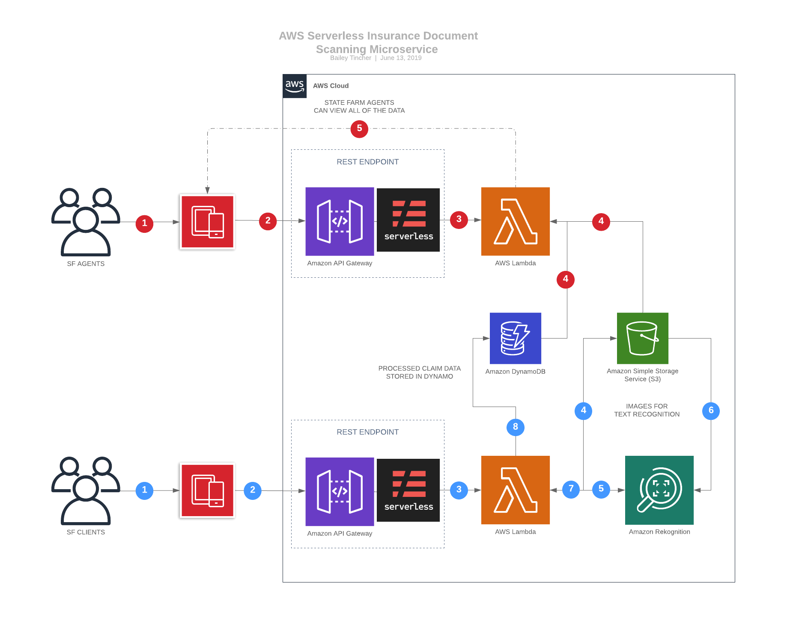

# Computer enVisioning the Future of Claims Filing

A fully server-less micro-service to enhance claims data entry through computer vision and the versatility of the public cloud

## How It Works

The client-side front end is an iOS application built with designed to be integrated as a feature into the State Farm Mobile App. The employee side front-end is a progressive web app built in react to offer clean views for both mobile and web. The iOS front end communicates the photos via REST through a serverless API gateway and AWS lambda endpoint.  From there we process the images and upload them to an S3 bucket where Amazon's Rekognition API uses computer vision to extract the text data from the images.

We then pass the text through a handful of Python modules to parse the client's information and send it back through to the mobile app where the user can confirm that the information was processed correctly.  Once the user submits, it's then uploaded to a Dynamo database where the agent's front end side can request the information from.

## Technologies

* [serverless](https://serverless.com/) - Application framework used to manage requests between front end and back end.
* [AWS Lambda](https://aws.amazon.com/lambda/) - Processes image data and communicates it with other AWS services.
* [S3 Buckets]((https://aws.amazon.com/s3/)) - Used to store the uploaded images for use by Rekognition.
* [Rekognition](https://aws.amazon.com/rekognition/) - Amazon's computer vision API: extracts the textual content from the images.
* [DynamoDB](https://aws.amazon.com/dynamodb/) - Document database used to store the client's processed information.

## Contributors

* **Bailey Tincher** - *Full Stack*
* **Jackie Oh** - *Mobile Dev*
* **Grace Robbins** - *Mobile Dev*
* **Connor McCloskey** - *Back End*
* **Alok Kamatar** - *Back End*
* **Divya Bhati** - *Back End*

## Acknowledgments

* The amazing people at State Farm who organized Hack Day
* Amazon for the various AWS services they provide
* Eric Hughes sparked our initial motivation from within
